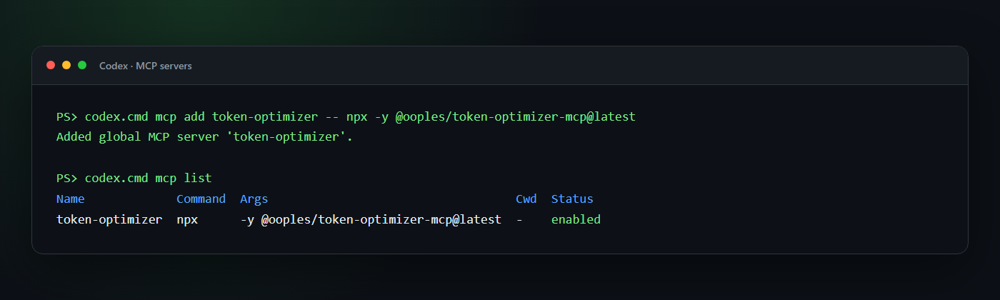
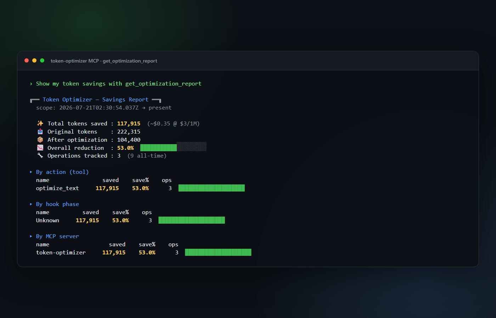

# Token Optimizer MCP

> Give Codex, Claude, Cursor, and other MCP clients more room to think with cached context, compact diffs, smart tools, and visible token-savings reports.

[](https://www.npmjs.com/package/@ooples/token-optimizer-mcp)
[](https://github.com/ooples/token-optimizer-mcp/actions/workflows/ci.yml)
[](https://nodejs.org/)
[](./LICENSE)

Token Optimizer is a local [Model Context Protocol](https://modelcontextprotocol.io/) server. It reduces the text sent back into an agent's context by caching large payloads, returning diffs on repeated reads, filtering noisy command output, and recording the result of every measurable optimization.

- **74 MCP tools** in the current release
- **No hosted service required** for core caching and compression
- **SQLite-backed persistence** across conversations
- **Brotli compression** with token-aware keep-or-skip decisions
- **Built-in savings reports** by tool, hook phase, and MCP server

## Installation

Every client launches the same stdio server—`npx -y @ooples/token-optimizer-mcp@latest`—but stores its MCP configuration and agent instructions differently.

| Client             | Fastest setup                                                                                                | Verify                            |
| ------------------ | ------------------------------------------------------------------------------------------------------------ | --------------------------------- |
| Codex              | `codex mcp add token-optimizer -- npx -y @ooples/token-optimizer-mcp@latest`                                 | `codex mcp get token-optimizer`   |
| Claude Code        | `claude mcp add --transport stdio --scope user token-optimizer -- npx -y @ooples/token-optimizer-mcp@latest` | `claude mcp get token-optimizer`  |
| GitHub Copilot CLI | `copilot mcp add token-optimizer -- npx -y @ooples/token-optimizer-mcp@latest`                               | `copilot mcp get token-optimizer` |
| Gemini CLI         | `gemini mcp add --scope user token-optimizer npx -y @ooples/token-optimizer-mcp@latest`                      | `gemini mcp list`                 |
| OpenCode           | Add the `mcp` block below to `opencode.json`                                                                 | `opencode mcp list`               |

### Codex

#### 1. Add the MCP server

```bash
codex mcp add token-optimizer -- npx -y @ooples/token-optimizer-mcp@latest
```

On Windows, if PowerShell blocks the `codex.ps1` shim, use the command launcher directly:

```powershell
codex.cmd mcp add token-optimizer -- npx -y @ooples/token-optimizer-mcp@latest
```

This writes the server to `~/.codex/config.toml`. Codex CLI, the Codex IDE extension, and the Codex app on the same host share that configuration.

#### 2. Verify the installation

```bash
codex mcp get token-optimizer
codex mcp list
```



Start a new Codex conversation after installation so the new tools are discovered. In an interactive CLI session, `/mcp` shows the tools available to the conversation.

#### 3. Tell Codex when to use it

MCP registration makes the tools available; it does not transparently replace Codex's built-in file tools. Add the guidance from [`integrations/AGENTS.md`](./integrations/AGENTS.md) to your project `AGENTS.md`, or start with this smaller rule:

```markdown
## Token optimization

Use the token-optimizer MCP for large or repeated reads:

- `smart_read` for files over roughly 400 lines and for files already read once.
- `smart_glob`/`smart_grep` for large search results.
- `optimize_text` to store bulky text outside the model context.
- `get_optimization_report` when the user asks for token or compression stats.

Use normal tools for small, one-off operations.
```

#### Equivalent manual Codex configuration

If you prefer to edit `~/.codex/config.toml` yourself:

```toml
[mcp_servers.token-optimizer]
command = "npx"
args = ["-y", "@ooples/token-optimizer-mcp@latest"]

# Optional: keep the cache in a custom location.
# env = { TOKEN_OPTIMIZER_CACHE_DIR = "/absolute/path/to/cache" }
```

### Claude Code

#### 1. Add the MCP server

Add Token Optimizer at user scope so it is available in every project:

```bash
claude mcp add --transport stdio --scope user token-optimizer -- \
  npx -y @ooples/token-optimizer-mcp@latest
```

#### 2. Verify the installation

```bash
claude mcp get token-optimizer
claude mcp list
```

Inside Claude Code, `/mcp` shows the live connection, tool count, and server status.

#### 3. Add optimization guidance or hooks

For MCP-only setup, add the recommendations from [`integrations/AGENTS.md`](./integrations/AGENTS.md) to your project's `CLAUDE.md`.

For the richest integration, install the repository's Claude Code plugin. It bundles the MCP server, optimization skill, and large-read hook. Run these commands **inside Claude Code**:

```text
/plugin marketplace add ooples/token-optimizer-mcp
/plugin install token-optimizer@token-optimizer
/reload-plugins
```

The standalone global installer can also configure the Claude Code hooks and supported desktop clients:

```bash
npm install -g @ooples/token-optimizer-mcp@latest
```

On Windows, a restrictive PowerShell policy may need this user-scoped adjustment first:

```powershell
Set-ExecutionPolicy -ExecutionPolicy RemoteSigned -Scope CurrentUser
npm install -g @ooples/token-optimizer-mcp@latest
```

Interactive global installs run the hook installer; CI and local dependency installs skip it. If automatic setup is skipped, use `install-hooks.ps1` on Windows or `install-hooks.sh` on macOS/Linux. See the [Claude Code MCP guide](https://code.claude.com/docs/en/mcp) and this project's [hook installation guide](./docs/HOOKS-INSTALLATION.md).

### GitHub Copilot CLI

#### 1. Add the MCP server

On current Copilot CLI releases:

```bash
copilot mcp add token-optimizer -- npx -y @ooples/token-optimizer-mcp@latest
```

If your Copilot CLI does not expose `copilot mcp` yet, save this as `~/.copilot/mcp-config.json`:

```json
{
  "mcpServers": {
    "token-optimizer": {
      "type": "local",
      "command": "npx",
      "args": ["-y", "@ooples/token-optimizer-mcp@latest"],
      "tools": ["*"]
    }
  }
}
```

A ready-made copy is available at [`integrations/copilot/mcp-config.json`](./integrations/copilot/mcp-config.json).

#### 2. Verify the installation

```bash
copilot mcp get token-optimizer
copilot mcp list
```

Inside an interactive Copilot session, `/mcp show token-optimizer` displays the connection status and available tools.

#### 3. Add optimization guidance

Keep [`integrations/AGENTS.md`](./integrations/AGENTS.md) as the repository's `AGENTS.md`, or adapt the same guidance into `.github/copilot-instructions.md`. See [GitHub's Copilot CLI MCP guide](https://docs.github.com/en/copilot/how-tos/copilot-cli/customize-copilot/add-mcp-servers).

### Gemini CLI

#### 1. Add the MCP server

Add Token Optimizer directly at user scope:

```bash
gemini mcp add --scope user token-optimizer npx -y @ooples/token-optimizer-mcp@latest
```

Alternatively, install this repository as a Gemini extension so the MCP configuration and `GEMINI.md` guidance are packaged together:

```bash
gemini extensions install https://github.com/ooples/token-optimizer-mcp --auto-update
```

#### 2. Verify the installation

```bash
gemini mcp list
gemini extensions list
```

Run `/mcp` inside Gemini CLI to inspect the connection. Restart Gemini CLI after installing or updating the extension.

#### 3. Add optimization guidance

Direct MCP users should copy [`GEMINI.md`](./GEMINI.md) into the project or merge its rules into an existing `GEMINI.md`. Extension users receive that context file with the extension. See the official [Gemini MCP guide](https://geminicli.com/docs/tools/mcp-server/) and [extension guide](https://geminicli.com/docs/extensions/reference/).

### OpenCode

#### 1. Add the MCP server

Create or update `opencode.json` in your project:

```json
{
  "$schema": "https://opencode.ai/config.json",
  "mcp": {
    "token-optimizer": {
      "type": "local",
      "command": ["npx", "-y", "@ooples/token-optimizer-mcp@latest"],
      "enabled": true
    }
  },
  "instructions": ["./AGENTS.md"]
}
```

For a global installation, merge the same `mcp` entry into `~/.config/opencode/opencode.json`.

#### 2. Verify the installation

```bash
opencode mcp list
```

The output shows configured servers and their connection status.

#### 3. Add optimization guidance

Copy [`integrations/AGENTS.md`](./integrations/AGENTS.md) to the project as `AGENTS.md`; the `instructions` entry above loads it. See the [OpenCode MCP guide](https://opencode.ai/docs/mcp-servers/).

### Generic MCP configuration

Any stdio-capable MCP client can launch Token Optimizer with:

```json
{
  "mcpServers": {
    "token-optimizer": {
      "command": "npx",
      "args": ["-y", "@ooples/token-optimizer-mcp@latest"]
    }
  }
}
```

Additional ready-made integration files are available for [Claude Desktop](./examples/claude_desktop_config.json), [Codex](./integrations/codex/config.toml), [Gemini CLI](./integrations/gemini/), [OpenCode](./integrations/opencode/), and [GitHub Copilot](./integrations/copilot/mcp-config.json).

## See it in action



_Real `get_optimization_report` output from an MCP smoke run over this repository's tool reference, server source, and dependency lockfile. Savings vary with content and workflow._

## Use it

You normally use Token Optimizer by asking your agent in plain language:

```text
Use token-optimizer smart_read for the large server file, then use it again
after the edit so only the diff comes back.
```

```text
Cache this API response with optimize_text under the key customer-schema,
then retrieve it only if we need the full payload again.
```

```text
Show my token savings with get_optimization_report.
```

For clients that expose direct MCP tool calls, the core inputs are small JSON objects:

```json
{
  "tool": "smart_read",
  "arguments": {
    "path": "/absolute/path/to/large-file.ts"
  }
}
```

```json
{
  "tool": "optimize_text",
  "arguments": {
    "text": "A large response, log, document, or generated artifact...",
    "key": "stable-reference-key",
    "quality": 11
  }
}
```

```json
{
  "tool": "get_optimization_report",
  "arguments": {
    "topN": 10
  }
}
```

## Understand the compression stats

`optimize_text` returns measurements with every call. This example uses a deliberately repetitive payload to make every field easy to see; it is not a benchmark:

```json
{
  "success": true,
  "key": "customer-schema",
  "originalTokens": 4180,
  "compressedTokens": 72,
  "tokensSaved": 4108,
  "percentSaved": 99.55,
  "cached": true,
  "compressionUsed": true
}
```

`get_optimization_report` aggregates recorded operations into:

- original, optimized, and saved token totals;
- overall reduction percentage;
- operations tracked;
- breakdowns by action/tool, hook phase, and MCP server;
- optional date-range and session filters.

Two tools sound similar but serve different purposes:

| Tool            | Use it for                                                  | Context-window effect                                     |
| --------------- | ----------------------------------------------------------- | --------------------------------------------------------- |
| `optimize_text` | Store bulky text under a key and return a compact reference | Reduces text kept in the active context                   |
| `compress_text` | Produce Brotli/base64 data for storage or transport         | May use **more** model tokens if pasted back into context |

If your goal is a smaller prompt, prefer `optimize_text`. Use `compress_text` only when you specifically need byte compression.

## What is included

| Capability              | Representative tools                                                                                | What gets smaller or faster              |
| ----------------------- | --------------------------------------------------------------------------------------------------- | ---------------------------------------- |
| Context and compression | `optimize_text`, `get_cached`, `count_tokens`, `analyze_optimization`, `context_delta`              | Large payloads and repeated context      |
| File and Git operations | `smart_read`, `smart_write`, `smart_edit`, `smart_grep`, `smart_glob`, `smart_diff`, `smart_status` | File contents, search results, and diffs |
| Caching                 | `smart_cache`, `cache_warmup`, `cache_invalidation`, `cache_compression`, `predictive_cache`        | Repeated computation and retrieval       |
| APIs and databases      | `smart_api_fetch`, `smart_sql`, `smart_graphql`, `smart_rest`, `smart_schema`                       | Responses, schemas, and query analysis   |
| Build and system tasks  | `smart_build`, `smart_test`, `smart_lint`, `smart_logs`, `smart_processes`                          | Build logs and diagnostic output         |
| Intelligence            | `smart-summarization`, `pattern-recognition`, `natural-language-query`, `recommendation-engine`     | Analysis and summaries                   |
| Analytics               | `get_optimization_report`, `get_action_analytics`, `get_hook_analytics`, `export_analytics`         | Token-savings visibility                 |

See [`docs/TOOLS.md`](./docs/TOOLS.md) for detailed tool inputs and examples.

## Requirements and data

- Node.js 18 or newer
- npm 9 or newer
- An MCP client with stdio transport support

Default local data locations include:

- cache: `~/.token-optimizer-cache/`
- analytics: `~/.token-optimizer-mcp/analytics.db`
- sessions and configuration: `~/.token-optimizer/`

Set `TOKEN_OPTIMIZER_CACHE_DIR` to override the cache location.

## Technical reference

The detailed operational material below is intentionally retained for users who want to understand the complete tool surface, hooks pipeline, performance controls, analytics, and troubleshooting behavior.

### Complete Tool Reference (74 Total)

#### Core Caching & Optimization (8 tools)

<details>
<summary>Click to expand</summary>

- **optimize_text** - Compress and cache text (primary tool for token reduction)
- **get_cached** - Retrieve previously cached text
- **compress_text** - Compress text using Brotli
- **decompress_text** - Decompress Brotli-compressed text
- **count_tokens** - Count tokens using tiktoken (GPT-4 tokenizer)
- **analyze_optimization** - Analyze text and get optimization recommendations
- **get_cache_stats** - View cache hit rates and compression ratios
- **clear_cache** - Clear all cached data

**Usage Example**:

```typescript
// Cache large content to remove it from context window
optimize_text({
  text: 'Large API response or file content...',
  key: 'api-response-key',
  quality: 11,
});
// Result: 60-90% token reduction
```

</details>

#### Smart File Operations (10 tools)

<details>
<summary>Click to expand</summary>

Optimized replacements for standard file tools with intelligent caching and diff-based updates:

- **smart_read** - Read files with 80% token reduction through caching and diffs
- **smart_write** - Write files with verification and change tracking
- **smart_edit** - Line-based file editing with diff-only output (90% reduction)
- **smart_grep** - Search file contents with match-only output (80% reduction)
- **smart_glob** - File pattern matching with path-only results (75% reduction)
- **smart_diff** - Git diffs with diff-only output (85% reduction)
- **smart_branch** - Git branch listing with structured JSON (60% reduction)
- **smart_log** - Git commit history with smart filtering (75% reduction)
- **smart_merge** - Git merge management with conflict analysis (80% reduction)
- **smart_status** - Git status with status-only output (70% reduction)

**Usage Example**:

```typescript
// Read a file with automatic caching
smart_read({ path: '/path/to/file.ts' });
// First read: full content
// Subsequent reads: only diff (80% reduction)
```

</details>

#### API & Database Operations (10 tools)

<details>
<summary>Click to expand</summary>

Intelligent caching and optimization for external data sources:

- **smart_api_fetch** - HTTP requests with caching and retry logic (83% reduction on cache hits)
- **smart-cache-api** - API response caching with TTL/ETag/event-based strategies
- **smart_database** - Database queries with connection pooling and caching (83% reduction)
- **smart_sql** - SQL query analysis with optimization suggestions (83% reduction)
- **smart_schema** - Database schema analysis with intelligent caching
- **smart_graphql** - GraphQL query optimization with complexity analysis (83% reduction)
- **smart_rest** - REST API analysis with endpoint discovery (83% reduction)
- **smart_orm** - ORM query optimization with N+1 detection (83% reduction)
- **smart_migration** - Database migration tracking (83% reduction)
- **smart_websocket** - WebSocket connection management with message tracking

**Usage Example**:

```typescript
// Fetch API with automatic caching
smart_api_fetch({
  method: 'GET',
  url: 'https://api.example.com/data',
  ttl: 300,
});
// Cached responses: 95% token reduction
```

</details>

#### Build & Test Operations (10 tools)

<details>
<summary>Click to expand</summary>

Development workflow optimization with intelligent caching:

- **smart_build** - TypeScript builds with diff-based change detection
- **smart_test** - Test execution with incremental test selection
- **smart_lint** - ESLint with incremental analysis and auto-fix
- **smart_typecheck** - TypeScript type checking with caching
- **smart_install** - Package installation with dependency analysis
- **smart_docker** - Docker operations with layer analysis
- **smart_logs** - Log aggregation with pattern filtering
- **smart_network** - Network diagnostics with anomaly detection
- **smart_processes** - Process monitoring with resource tracking
- **smart_system_metrics** - System resource monitoring with performance recommendations

**Usage Example**:

```typescript
// Run tests with caching
smart_test({
  onlyChanged: true, // Only test changed files
  coverage: true,
});
```

</details>

#### Advanced Caching (10 tools)

<details>
<summary>Click to expand</summary>

Enterprise-grade caching strategies with 87-92% token reduction:

- **smart_cache** - Multi-tier cache (L1/L2/L3) with 6 eviction strategies (90% reduction)
- **cache_warmup** - Intelligent cache pre-warming with schedule support (87% reduction)
- **cache_analytics** - Real-time dashboards and trend analysis (88% reduction)
- **cache-benchmark** - Performance testing and strategy comparison (89% reduction)
- **cache_compression** - 6 compression algorithms with adaptive selection (89% reduction)
- **cache_invalidation** - Dependency tracking and pattern-based invalidation (88% reduction)
- **cache_optimizer** - ML-based recommendations and bottleneck detection (89% reduction)
- **cache_partition** - Sharding and consistent hashing (87% reduction)
- **cache_replication** - Distributed replication with conflict resolution (88% reduction)
- **predictive_cache** - ML-based predictive caching with ARIMA/LSTM (91% reduction)

**Usage Example**:

```typescript
// Configure multi-tier cache
smart_cache({
  operation: 'configure',
  evictionStrategy: 'LRU',
  l1MaxSize: 1000,
  l2MaxSize: 10000,
});
```

</details>

#### Monitoring & Dashboards (7 tools)

<details>
<summary>Click to expand</summary>

Comprehensive monitoring with 88-92% token reduction through intelligent caching:

- **alert_manager** - Multi-channel alerting (email, Slack, webhook) with routing (89% reduction)
- **metric_collector** - Time-series metrics with multi-source support (88% reduction)
- **monitoring_integration** - External platform integration (Prometheus, Grafana, Datadog) (87% reduction)
- **custom_widget** - Dashboard widgets with template caching (88% reduction)
- **data_visualizer** - Interactive visualizations with SVG optimization (92% reduction)
- **health_monitor** - System health checks with state compression (91% reduction)
- **log_dashboard** - Log analysis with pattern detection (90% reduction)

**Usage Example**:

```typescript
// Create an alert
alert_manager({
  operation: 'create-alert',
  alertName: 'high-cpu-usage',
  channels: ['slack', 'email'],
  threshold: { type: 'above', value: 80 },
});
```

</details>

#### System Operations (6 tools)

<details>
<summary>Click to expand</summary>

System-level operations with smart caching:

- **smart_cron** - Scheduled task management (cron/Windows Task Scheduler) (85% reduction)
- **smart_user** - User and permission management across platforms (86% reduction)
- **smart_ast_grep** - Structural code search with AST indexing (83% reduction)
- **get_session_stats** - Session-level token usage statistics
- **analyze_project_tokens** - Project-wide token analysis and cost estimation
- **optimize_session** - Compress large file operations from current session

**Usage Example**:

```typescript
// View session token usage
get_session_stats({});
// Result: Detailed breakdown of token usage by tool
```

</details>

#### Intelligence & Summarization (6 tools)

<details>
<summary>Click to expand</summary>

- **intelligent-assistant** - Context-aware assistance with compact recommendations
- **natural-language-query** - Natural-language querying over structured data
- **pattern-recognition** - Pattern discovery with summarized findings
- **predictive-analytics** - Predictive analysis with concise results
- **recommendation-engine** - Ranked, context-aware recommendations
- **smart-summarization** - Token-aware summarization for large content

</details>

#### Token Analytics (5 tools)

<details>
<summary>Click to expand</summary>

- **get_optimization_report** - Complete savings report with totals and breakdowns
- **get_action_analytics** - Savings aggregated by action or tool
- **get_hook_analytics** - Savings aggregated by hook phase
- **get_mcp_server_analytics** - Savings aggregated by MCP server
- **export_analytics** - Export recorded analytics for external analysis

</details>

#### Context State & Storage (2 tools)

<details>
<summary>Click to expand</summary>

- **optimization_storage** - Persist and retrieve optimized content
- **context_delta** - Track compact context changes between states

</details>

### Architecture and Global Hooks

#### Analytics workflow and storage

<details>
<summary>Click to expand</summary>

Granular token usage analytics for pinpointing optimization opportunities:

- **get_hook_analytics** - Token usage breakdown by hook phase (PreToolUse, PostToolUse, etc.)
- **get_action_analytics** - Token usage breakdown by tool/action (Read, Write, Grep, etc.)
- **get_mcp_server_analytics** - Token usage breakdown by MCP server (token-optimizer, filesystem, etc.)
- **export_analytics** - Export analytics data in JSON or CSV format with filtering

**Usage Example**:

```typescript
// Get per-hook analytics
get_hook_analytics({
  startDate: '2025-01-01T00:00:00Z',
  endDate: '2025-12-31T23:59:59Z',
});
// Result: Shows which hooks consume the most tokens

// Get per-action analytics
get_action_analytics({});
// Result: Shows which tools use the most tokens

// Export analytics as CSV
export_analytics({
  format: 'csv',
  hookPhase: 'PreToolUse',
});
// Result: CSV export filtered by PreToolUse hook
```

**Key Features**:

- Per-hook phase tracking (PreToolUse, PostToolUse, SessionStart, etc.)
- Per-action tracking (Read, Write, count_tokens, etc.)
- Per-MCP-server tracking (token-optimizer, filesystem, GitHub, etc.)
- Date range filtering
- JSON and CSV export
- Persistent storage with SQLite
- Zero performance impact (async batched writes)

</details>

#### Global Hooks System (7-Phase Optimization)

This pipeline applies to the optional Claude Code global-hook installation. MCP-only installations in Codex, Copilot, Gemini, OpenCode, and other clients expose model-invoked tools but do not transparently intercept built-in operations.

When global hooks are installed, token-optimizer-mcp runs automatically on **every tool call**:

```
┌─────────────────────────────────────────────────────────────┐
│ Phase 1: PreToolUse - Tool Replacement                      │
│ ├─ Read   → smart_read   (80% token reduction)             │
│ ├─ Grep   → smart_grep   (80% token reduction)             │
│ └─ Glob   → smart_glob   (75% token reduction)             │
└─────────────────────────────────────────────────────────────┘
                          ↓
┌─────────────────────────────────────────────────────────────┐
│ Phase 2: Input Validation - Cache Lookups                   │
│ └─ get_cached checks if operation was already done          │
└─────────────────────────────────────────────────────────────┘
                          ↓
┌─────────────────────────────────────────────────────────────┐
│ Phase 3: PostToolUse - Output Optimization                  │
│ ├─ optimize_text for large outputs                          │
│ └─ compress_text for repeated content                       │
└─────────────────────────────────────────────────────────────┘
                          ↓
┌─────────────────────────────────────────────────────────────┐
│ Phase 4: Session Tracking                                   │
│ └─ Log all operations to operations-{sessionId}.csv         │
└─────────────────────────────────────────────────────────────┘
                          ↓
┌─────────────────────────────────────────────────────────────┐
│ Phase 5: UserPromptSubmit - Prompt Optimization             │
│ └─ Optimize user prompts before sending to API              │
└─────────────────────────────────────────────────────────────┘
                          ↓
┌─────────────────────────────────────────────────────────────┐
│ Phase 6: PreCompact - Pre-Compaction Optimization           │
│ └─ Optimize before Claude Code compacts the conversation    │
└─────────────────────────────────────────────────────────────┘
                          ↓
┌─────────────────────────────────────────────────────────────┐
│ Phase 7: Metrics & Reporting                                │
│ └─ Track token reduction metrics and generate reports       │
└─────────────────────────────────────────────────────────────┘
```

### Production Performance

Based on 38,000+ operations in real-world usage:

| Tool Category     | Avg Token Reduction | Cache Hit Rate |
| ----------------- | ------------------- | -------------- |
| File Operations   | 60-90%              | >80%           |
| API Responses     | 83-95%              | >75%           |
| Database Queries  | 83-90%              | >70%           |
| Build/Test Output | 70-85%              | >65%           |

**Per-Session Savings**: 300K-700K tokens (worth $0.90-$2.10 at $3/M tokens)

### Usage Examples

#### Basic Caching

```typescript
// Cache large content to remove from context window
const result = await optimize_text({
  text: 'Large API response or file content...',
  key: 'cache-key',
  quality: 11,
});
// Result: Original tokens removed, only cache key remains (~50 tokens)

// Retrieve later
const cached = await get_cached({ key: 'cache-key' });
// Result: Full original content restored
```

#### Smart File Reading

```typescript
// First read: full content
await smart_read({ path: '/src/app.ts' });

// Subsequent reads: only changes (80% reduction)
await smart_read({ path: '/src/app.ts' });
```

#### API Caching

```typescript
// First request: fetch and cache
await smart_api_fetch({
  method: 'GET',
  url: 'https://api.example.com/data',
  ttl: 300,
});

// Subsequent requests: cached (95% reduction)
await smart_api_fetch({
  method: 'GET',
  url: 'https://api.example.com/data',
});
```

#### Session Analysis

```typescript
// View token usage for current session
await get_session_stats({});
// Result: Breakdown by tool, operation, and savings

// Analyze entire project
await analyze_project_tokens({
  projectPath: '/path/to/project',
});
// Result: Cost estimation and optimization opportunities
```

### Technology Stack

- **Runtime**: Node.js 18+
- **Language**: TypeScript
- **Database**: SQLite (better-sqlite3)
- **Token Counting**: tiktoken (GPT-4 tokenizer)
- **Compression**: Brotli (built-in Node.js)
- **Caching**: Multi-tier LRU/LFU/FIFO caching
- **Protocol**: MCP SDK (@modelcontextprotocol/sdk)

### Supported AI Tools

Token Optimizer works with stdio-capable MCP clients and includes first-party setup guidance for:

- **OpenAI Codex** - MCP configuration plus AGENTS.md guidance
- **Claude Code** - Direct MCP setup or the bundled plugin, skill, and hooks
- **GitHub Copilot CLI** - User or repository MCP configuration
- **Google Gemini CLI** - Direct MCP setup or the bundled extension
- **OpenCode** - Local MCP configuration plus AGENTS.md instructions
- **Claude Desktop**, **Cursor**, **Cline**, and **Windsurf** - Standard MCP JSON configuration

See [Installation](#installation) for the supported commands and configuration files.

### Performance Characteristics

- **Compression Ratio**: 2-4x typical (up to 82x for repetitive content)
- **Context Window Savings**: 60-90% average across all operations
- **Cache Hit Rate**: >80% in typical usage
- **Operation Overhead**: <10ms for cache operations (optimized from 50-70ms)
- **Compression Speed**: ~1ms per KB of text
- **Hook Overhead**: <10ms per operation (7x improvement from in-memory optimizations)

#### Performance Optimizations

The PowerShell hooks have been optimized to reduce overhead from 50-70ms to <10ms through:

- **In-Memory Session State**: Session data kept in memory instead of disk I/O on every operation
- **Batched Log Writes**: Operation logs buffered and flushed every 5 seconds or 100 operations
- **Lazy Persistence**: Disk writes only occur when necessary (session end, optimization, reports)

#### Environment Variables

Control hook behavior with these environment variables:

#### Performance Controls

- **`TOKEN_OPTIMIZER_USE_FILE_SESSION`** (default: `false`)
  - Set to `true` to revert to file-based session tracking (legacy mode)
  - Use if you encounter issues with in-memory session state
  - Example: `$env:TOKEN_OPTIMIZER_USE_FILE_SESSION = "true"`

- **`TOKEN_OPTIMIZER_SYNC_LOG_WRITES`** (default: `false`)
  - Set to `true` to disable batched log writes
  - Forces immediate writes to disk (slower but more resilient)
  - Use for debugging or if logs are being lost
  - Example: `$env:TOKEN_OPTIMIZER_SYNC_LOG_WRITES = "true"`

- **`TOKEN_OPTIMIZER_DEBUG_LOGGING`** (default: `true`)
  - Set to `false` to disable DEBUG-level logging
  - Reduces log file size and improves performance
  - INFO/WARN/ERROR logs still written
  - Example: `$env:TOKEN_OPTIMIZER_DEBUG_LOGGING = "false"`

#### Development Path

- **`TOKEN_OPTIMIZER_DEV_PATH`**
  - Path to local development installation
  - Automatically set to `~/source/repos/token-optimizer-mcp` if not specified
  - Override for custom development paths
  - Example: `$env:TOKEN_OPTIMIZER_DEV_PATH = "C:\dev\token-optimizer-mcp"`

**Performance Impact**: Using in-memory mode (default) provides a 7x improvement in hook overhead:

- Before: 50-70ms per hook operation
- After: <10ms per hook operation
- 85% reduction in hook latency

### Monitoring Token Savings

#### Real-Time Session Monitoring

**To view your actual token SAVINGS**, use the `get_session_stats` tool:

```typescript
// View current session statistics with token savings breakdown
await get_session_stats({});
```

**Output includes:**

- **Total tokens saved** (this is the actual savings amount!)
- **Token reduction percentage** (e.g., "60% reduction")
- **Cache hit rate** and **compression ratios**
- **Breakdown by tool** (Read, Grep, Glob, etc.)
- **Top 10 most optimized operations** with before/after comparison

**Example Output:**

```json
{
  "sessionId": "abc-123",
  "totalTokensSaved": 125430, // ← THIS is your savings!
  "tokenReductionPercent": 68.2,
  "originalTokens": 184000,
  "optimizedTokens": 58570,
  "cacheHitRate": 72.0,
  "byTool": {
    "smart_read": { "saved": 45000, "percent": 80 },
    "smart_grep": { "saved": 32000, "percent": 75 }
  }
}
```

#### Session Tracking Files

All operations are automatically tracked in session data files:

**Location**: `~/.claude-global/hooks/data/current-session.txt`

**Format**:

```json
{
  "sessionId": "abc-123",
  "sessionStart": "20251031-082211",
  "totalOperations": 1250, // ← Number of operations
  "totalTokens": 184000, // ← Cumulative token COUNT
  "lastOptimized": 1698765432,
  "savings": {
    // ← Auto-updated every 10 operations (Issue #113)
    "totalTokensSaved": 125430, // Tokens saved by compression
    "tokenReductionPercent": 68.2, // Percentage of tokens saved
    "originalTokens": 184000, // Original token count before optimization
    "optimizedTokens": 58570, // Token count after optimization
    "cacheHitRate": 42.5, // Cache hit rate percentage
    "compressionRatio": 0.32, // Compression efficiency (lower is better)
    "lastUpdated": "20251031-092500" // Last savings update timestamp
  }
}
```

**New in v1.x**: The `savings` object is now automatically updated every 10 operations, eliminating the need to manually call `get_session_stats()` for real-time monitoring. This provides instant visibility into token optimization performance.

**How it works**:

- Every 10 operations, the PowerShell hooks automatically call `get_cache_stats()` MCP tool
- Savings metrics are calculated from cache performance data (compression ratio, original vs compressed sizes)
- The session file is atomically updated with the latest savings data
- If the MCP call fails, the update is skipped gracefully without blocking operations

**Note**: For detailed per-operation analysis, use `get_session_stats()`. The session file provides high-level aggregate metrics.

#### Project-Wide Analysis

Analyze token usage across your entire project:

```typescript
// Analyze project token costs
await analyze_project_tokens({
  projectPath: '/path/to/project',
});
```

**Provides:**

- Total token cost estimation
- Largest files by token count
- Optimization opportunities
- Cost projections at current API rates

#### Cache Performance

Monitor cache hit rates and storage efficiency:

```typescript
// View cache statistics
await get_cache_stats({});
```

**Metrics:**

- Total entries
- Cache hit rate (%)
- Average compression ratio
- Total storage saved
- Most frequently accessed keys

### Troubleshooting

#### CLI connection and discovery

#### The tools do not appear in Codex

1. Run `codex mcp get token-optimizer`.
2. Confirm the entry is enabled with `codex mcp list`.
3. Start a new Codex conversation.
4. Run `/mcp` in the interactive CLI and inspect the server status.

#### `codex` is blocked on Windows

PowerShell may reject the `codex.ps1` shim under a restrictive execution policy. Use `codex.cmd` for the installation and verification commands, or review your user-scoped PowerShell execution policy.

#### Remove Token Optimizer from Codex

```bash
codex mcp remove token-optimizer
```

This removes the Codex registration; it does not delete your local cache or analytics database.

#### Common Issues and Solutions

#### Issue: "Invalid or malformed JSON" in Claude Code Settings

**Symptom**: Claude Code shows "Invalid Settings" error after running install-hooks

**Cause**: UTF-8 BOM (Byte Order Mark) was added to settings.json files

**Solution**: Upgrade to v3.0.2+ which fixes the BOM issue:

```bash
npm install -g @ooples/token-optimizer-mcp@latest
```

If you're already on v3.0.2+, manually remove the BOM:

```powershell
# Windows: Remove BOM from settings.json
$content = Get-Content "~/.claude/settings.json" -Raw
$content = $content -replace '^\xEF\xBB\xBF', ''
$content | Set-Content "~/.claude/settings.json" -Encoding utf8NoBOM
```

```bash
# Linux: Remove BOM from settings.json
sed -i '1s/^\xEF\xBB\xBF//' ~/.claude/settings.json

# macOS: Remove BOM from settings.json (BSD sed requires empty string after -i)
sed -i '' '1s/^\xef\xbb\xbf//' ~/.claude/settings.json
```

#### Issue: Hooks Not Working After Installation

**Symptom**: Token optimization not occurring automatically

**Diagnosis**:

1. Check if hooks are installed:

   ```powershell
   # Windows
   Get-Content ~/.claude/settings.json | ConvertFrom-Json | Select-Object -ExpandProperty hooks
   ```

   ```bash
   # macOS/Linux
   cat ~/.claude/settings.json | jq .hooks
   ```

2. Verify dispatcher.ps1 exists:
   ```powershell
   # Windows
   Test-Path ~/.claude-global/hooks/dispatcher.ps1
   ```
   ```bash
   # macOS/Linux
   [ -f ~/.claude-global/hooks/dispatcher.sh ] && echo "Exists" || echo "Missing"
   ```

**Solution**: Re-run the installer:

```powershell
# Windows
powershell -ExecutionPolicy Bypass -File install-hooks.ps1
```

```bash
# macOS/Linux
bash install-hooks.sh
```

#### Issue: Low Cache Hit Rate (<50%)

**Symptom**: Session stats show cache hit rate below 50%

**Causes**:

1. Working with many new files (expected)
2. Cache was recently cleared
3. TTL (time-to-live) is too short

**Solutions**:

1. **Warm up the cache** before starting work:

   ```typescript
   await cache_warmup({
     paths: ['/path/to/frequently/used/files'],
     recursive: true,
   });
   ```

2. **Increase TTL** for stable APIs:

   ```typescript
   await smart_api_fetch({
     url: 'https://api.example.com/data',
     ttl: 3600, // 1 hour instead of default 5 minutes
   });
   ```

3. **Check cache size limits**:
   ```typescript
   await smart_cache({
     operation: 'configure',
     l1MaxSize: 2000, // Increase from default 1000
     l2MaxSize: 20000, // Increase from default 10000
   });
   ```

#### Issue: High Memory Usage

**Symptom**: Node.js process using excessive memory

**Cause**: Large cache in memory (L1/L2 tiers)

**Solution**: Configure cache limits:

```typescript
await smart_cache({
  operation: 'configure',
  evictionStrategy: 'LRU', // Least Recently Used
  l1MaxSize: 500, // Reduce L1 cache
  l2MaxSize: 5000, // Reduce L2 cache
});
```

Or clear the cache:

```typescript
await clear_cache({});
```

#### Issue: Slow First-Time Operations

**Symptom**: Initial Read/Grep/Glob operations are slow

**Cause**: Cache is empty, building indexes

**Solution**: This is expected behavior. Subsequent operations will be 80-90% faster.

To pre-warm the cache:

```typescript
await cache_warmup({
  paths: ['/src', '/tests', '/docs'],
  recursive: true,
  schedule: 'startup', // Auto-warm on every session start
});
```

#### Issue: "Permission denied" Errors on Windows

**Symptom**: Cannot write to cache or log files

**Cause**: PowerShell execution policy or file permissions

**Solution**:

1. **Set execution policy**:

   ```powershell
   Set-ExecutionPolicy -ExecutionPolicy RemoteSigned -Scope CurrentUser
   ```

2. **Check file permissions**:

   ```powershell
   icacls "$env:USERPROFILE\.token-optimizer"
   ```

3. **Re-run installer as Administrator** if needed

#### Issue: Cache Files Growing Too Large

**Symptom**: `~/.token-optimizer/cache.db` is >1GB

**Cause**: Caching very large files or many API responses

**Solution**:

1. **Clear old entries**:

   ```typescript
   await clear_cache({ olderThan: 7 }); // Clear entries older than 7 days
   ```

2. **Reduce cache retention**:

   ```typescript
   await smart_cache({
     operation: 'configure',
     defaultTTL: 3600, // 1 hour instead of 7 days
   });
   ```

3. **Manually delete cache** (nuclear option):
   ```bash
   rm -rf ~/.token-optimizer/cache.db
   ```

#### Getting Help

If you encounter issues not covered here:

1. **Check the hook logs**: `~/.claude-global/hooks/logs/dispatcher.log`
2. **Check session data**: `~/.claude-global/hooks/data/current-session.txt`
3. **File an issue**: [GitHub Issues](https://github.com/ooples/token-optimizer-mcp/issues)
   - Include debug logs
   - Include your OS and Node.js version
   - Include the output of `get_session_stats`

### Limitations

- **Small Text**: Best for content >500 characters (cache overhead on small snippets)
- **One-Time Content**: No benefit for content that won't be referenced again
- **Cache Storage**: Automatic cleanup after 7 days to prevent disk usage issues
- **Token Counting**: Uses GPT-4 tokenizer (approximation for Claude, but close enough)

## Development

```bash
git clone https://github.com/ooples/token-optimizer-mcp.git
cd token-optimizer-mcp
npm ci
npm run build
npm test
node scripts/mcp-smoke.mjs
```

To make Codex use your local build while developing:

```bash
codex mcp add token-optimizer-local -- node /absolute/path/to/token-optimizer-mcp/dist/server/index.js
```

## Documentation

- [Quick start](./docs/QUICK_START_GUIDE.md)
- [Tool reference](./docs/TOOLS.md)
- [Codex and agent guidance](./integrations/AGENTS.md)
- [Hook installation](./docs/HOOKS-INSTALLATION.md)
- [Testing](./docs/TESTING_INSTRUCTIONS.md)
- [Contributing](./docs/CONTRIBUTING.md)
- [Security policy](./SECURITY.md)
- [Changelog](./CHANGELOG.md)

## License

MIT License - see [LICENSE](./LICENSE) for details

## Author

Built for optimal Claude Code token efficiency by the ooples team.
